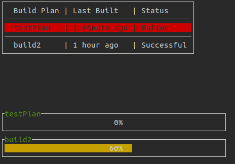

# Binfo [](https://travis-ci.org/serinth/binfo)

`Binfo` (Build Info) is a program to display CI/CD build status on the terminal. It is build using Golang and runnable either in Docker, as a Linux ELF binary or can be built from source. It uses [termui](https://github.com/gizak/termui) for the display and is intended to be lightweight even for small devices like Raspberry Pis.

# Screenshot

Automatically updates every 10 seconds.



Push `q` to quit.

# Configuration

For Bamboo, username and password is not necessary if you can reach the endpoints.
Just fill in the short project key and plan key which can be found in the URL when you navigate to your build.

```json
{
  "buildServer":"http://localhost:8085",
  "credentials": {
    "username":"",
    "password":""
  },
  "projects": [ "PROJECTKEY1-PLANKEY1", "PROJECTKEY2-PLANKEY2" ]
}
```

`Binfo` will automatically get the most recent build status.

# Build From Source

```bash
glide install
go build ./...
cd app
./app
```

# Precompiled Packages

For now there's only the Linux x64 binary so you will still need to
1. clone this repo `git clone https://github.com/serinth/binfo.git`
2. Update `config/config.json`
2. run linux binary `cd bin && ./binfo_x64`


## Currently Supported CI/CD software
- [Bamboo](https://developer.atlassian.com/bamboodev/rest-apis)
